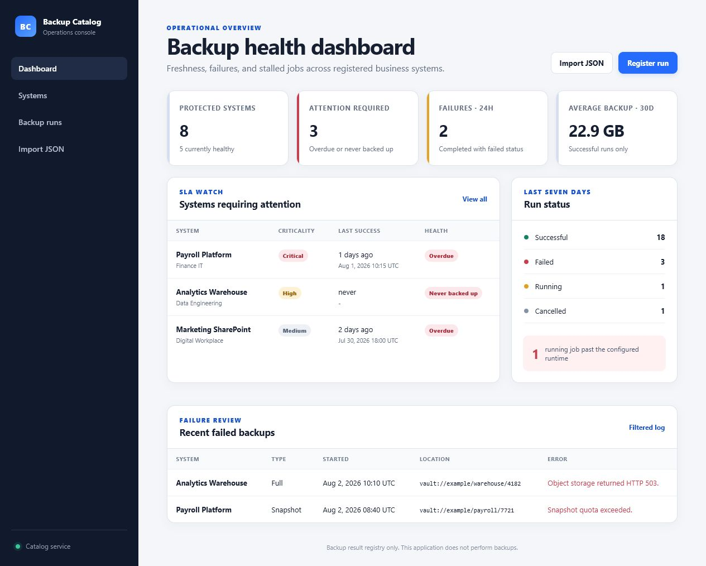
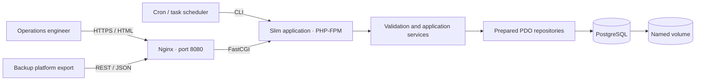
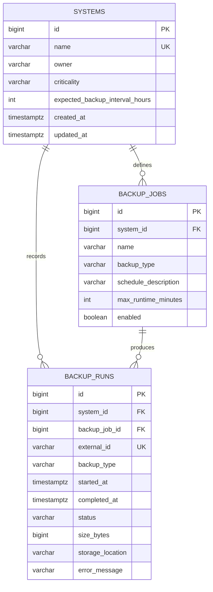

# Backup Catalog

[](https://github.com/German4341374/backup-catalog/actions/workflows/ci.yml)
[](https://www.php.net/)
[](LICENSE)

A place to keep backup results without digging through a different log for each system.
You can record runs, import them from JSON, and see which systems haven't had a successful
backup when expected.

It only keeps track of results. It doesn't create backups or connect to backup agents.



## Features

- CRUD workflows for protected systems with ownership, criticality, and backup interval policies.
- Manual and JSON-based backup run registration with idempotent external IDs.
- Dashboard cards for healthy and overdue systems, failures in the last 24 hours, stalled jobs, and average successful backup size.
- Filters by system, status, backup type, and time range.
- REST API, responsive Twig UI, and CSV export.
- CLI commands for migration, import, demo data, and scheduled overdue checks.
- PostgreSQL constraints, partial indexes, prepared PDO statements, and checksum-protected SQL migrations.
- PHPStan level 8, PHPUnit unit/integration tests, PHP CS Fixer, container health checks, and GitHub Actions.

## Architecture



The code follows a small layered design:

- `Domain` defines supported values and typed records.
- `Application` contains validation, import, dashboard, and export use cases.
- `Infrastructure` owns database connections, migrations, and SQL repositories.
- `Presentation` contains Slim controllers, middleware, Twig rendering, and uniform errors.

## Data model



`System` is stored as `systems` to avoid the SQL keyword and PHP built-in-name ambiguity. Backup jobs describe expected schedules and maximum runtime; backup runs hold the observed result.

## Prerequisites

- Docker Engine 27+ with Docker Compose v2.
- GNU Make is optional. On Windows, use Docker Desktop with the WSL2 backend and run commands from an Ubuntu WSL terminal.
- For a native workflow: PHP 8.5, Composer 2.10, and PostgreSQL 18.

## Docker setup

```bash
cp .env.example .env
docker compose up -d --build --wait
curl --fail http://localhost:8080/health
```

Open <http://localhost:8080>. The first application start applies migrations and inserts deterministic sample systems and runs. Stop the stack with `docker compose down`; add `--volumes` only when the local database may be deleted.

The development image includes test tools. The production target excludes development dependencies and disables error detail:

```bash
docker build --target production -t backup-catalog:local .
docker compose -f compose.yaml -f compose.production.yaml up -d --build --wait
```

## Native setup

```bash
cp .env.example .env
composer install
php bin/console migrate
php -S 127.0.0.1:8080 -t public public/index.php
```

Update `DATABASE_DSN`, `DATABASE_USER`, and `DATABASE_PASSWORD` in the ignored `.env` file. The built-in PHP server is for development only; the container stack uses Nginx and PHP-FPM.

## CLI

```bash
php bin/console import-backups examples/backup-runs.json
php bin/console generate-demo
php bin/console check-overdue
```

`import-backups` rejects the whole document when any new record is invalid and skips external IDs already present. `check-overdue` prints JSON and exits `2` when attention is required, making it suitable for a scheduler or monitoring wrapper.

### JSON import example

```json
{
  "runs": [
    {
      "system": "Customer CRM",
      "job": "Nightly full",
      "externalId": "vendor-20260802-001",
      "type": "Full",
      "startedAt": "2026-08-02T01:00:00Z",
      "completedAt": "2026-08-02T01:32:00Z",
      "status": "Successful",
      "sizeBytes": 21474836480,
      "storageLocation": "vault://primary/customer-crm/2026-08-02"
    }
  ]
}
```

The accepted backup types are `Full`, `Incremental`, and `Snapshot`. Status must be `Running`, `Successful`, `Failed`, or `Cancelled`. A running record must not have `completedAt`; every other status requires it.

## REST API

| Method | Path | Purpose |
| --- | --- | --- |
| `GET` | `/health` | Application and database health |
| `GET` | `/api/dashboard` | Aggregated health and failure data |
| `GET`, `POST` | `/api/systems` | Filter/list or create systems |
| `GET`, `PUT`, `PATCH`, `DELETE` | `/api/systems/{id}` | Read, update, or remove a system |
| `GET`, `POST` | `/api/backup-runs` | Filter/list or register runs |
| `GET` | `/api/backup-runs/{id}` | Read one run |
| `POST` | `/api/backup-runs/import` | Import a JSON document |
| `GET` | `/api/backup-runs/export.csv` | Export filtered runs |

```bash
curl --fail http://localhost:8080/api/dashboard

curl --fail -X POST http://localhost:8080/api/systems \
  -H 'Content-Type: application/json' \
  -d '{"name":"Demo ERP","owner":"Business IT","criticality":"High","expectedBackupIntervalHours":24}'

curl --fail 'http://localhost:8080/api/backup-runs?status=Failed&type=Full'
```

Errors use one JSON shape with `status`, `title`, `detail`, `requestId`, and optional field-level `errors`.

## Tests and quality checks

```bash
composer validate --strict
composer lint
composer analyse
composer audit
composer test
docker compose config --quiet
docker build --target production -t backup-catalog:local .
```

Or run the containerized checks:

```bash
make setup
make check
```

Unit tests cover validation and formatting. Integration tests apply the real PostgreSQL migrations, exercise prepared repositories and dashboard queries, and call the Slim API. When PostgreSQL is unavailable, database-dependent tests are reported as skipped; GitHub Actions provides PostgreSQL and runs them.

## Scheduled task example

Run every 30 minutes from a host that can execute the application container:

```cron
*/30 * * * * cd /opt/backup-catalog && docker compose exec -T app php bin/console check-overdue >> /var/log/backup-catalog-overdue.log 2>&1
```

Exit code `0` means no overdue item, `2` means attention is required, and `1` means the check itself failed. A real deployment should forward those outcomes to the organization's existing monitoring system.

## Security decisions

- PDO emulated prepares are disabled, and values never enter SQL through string concatenation.
- HTML escaping is enabled globally in Twig; state-changing HTML forms require a session-bound CSRF token.
- API errors hide exception detail for server failures and include a request ID for log correlation.
- Containers drop Linux capabilities, use `no-new-privileges`, and run PHP-FPM and Nginx as unprivileged users.
- Credentials come from environment variables. `.env` and database state are ignored by Git.
- Imported files are capped at 5 MB/5,000 records; input lengths and state/time combinations are validated again by PostgreSQL constraints.
- The sample storage locations and credentials are local-only placeholders. Replace the database password before any shared deployment and terminate TLS at a trusted ingress or reverse proxy.

See [SECURITY.md](SECURITY.md) and [the operations runbook](docs/operations-runbook.md) for additional guidance.

## Limitations

- No authentication or authorization is included; expose the application only on a trusted administrative network or place it behind an identity-aware proxy.
- The catalog trusts submitted results and does not verify objects in backup storage.
- Backup job CRUD is intentionally out of scope; seed/migration data demonstrates job linkage.
- Migrations use a small project-specific runner rather than a general migration framework.
- The dashboard is operational, not a compliance record: there is no immutable audit log or retention policy.

## Project structure

```text
bin/                 CLI entry point
config/              dependency container and routes
database/migrations/ ordered, checksum-protected SQL
docker/              PHP-FPM and Nginx configuration
public/              front controller and CSS
src/                 domain, application, infrastructure, presentation
templates/           Twig UI
tests/               unit and PostgreSQL integration tests
docs/                design and operations notes
```

## Contributing

Use Conventional Commits and read [CONTRIBUTING.md](CONTRIBUTING.md) before opening a pull request. The project is available under the [MIT License](LICENSE).
